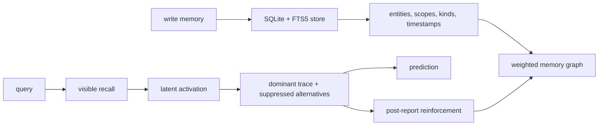

# King Synapse

<p align="center">
  <strong>Readable memory for coding agents.</strong><br />
  A local associative memory network that remembers facts, follows hidden influences,
  explains why one trace won, and learns after the current answer is finished.
</p>

<p align="center">
  <a href="https://github.com/lake121380-source/king-synapse/stargazers"></a>
  <a href="https://github.com/lake121380-source/king-synapse/actions/workflows/ci.yml"></a>
  <a href="https://github.com/lake121380-source/king-synapse/blob/main/LICENSE"></a>
  
  
</p>

## Why This Exists

Most coding agents still forget like a browser tab.

They may remember a note, a rule, or a chat summary, but they usually cannot
show the chain behind a thought: what memory started it, what hidden influence
pulled it forward, which alternatives were suppressed, and what likely happens
next.

King Synapse treats memory as a network, not a notebook.

```text
visible memory -> hidden influence -> dominant trace -> possible future
                 \-> suppressed alternatives stay visible
```

That makes it useful for long-running coding agents that need to stop repeating
the same mistakes, stop re-learning your preferences, and explain their memory
instead of hiding it inside a black box.

## What It Does

- Stores memories locally in SQLite with explicit scope, kind, provenance, and time.
- Connects memories with weighted edges so recall can spread through a graph.
- Finds visible memories from a query, then activates hidden influences nearby.
- Reports the dominant trace and the suppressed alternatives.
- Predicts likely next influences from the winning trace.
- Reinforces an association only after the current report is already captured.
- Exposes the same engine through a CLI and an MCP server for coding agents.

## Research Status

Current research track:

- `v0.6.0-cognitive-validation`: Phase 1 validation freeze.
- Phase 1.2 benchmark scaling: 200 cognitive-memory cases, `full_synapse_score = 0.9400`, `hybrid_rag = 0.5550`, gain `+0.3850`.
- [RFC-013 Adaptive Memory Dynamics](docs/rfc/RFC-013-adaptive-memory-dynamics.md): Phase 2 design entry point.
- [Phase 2 Experiment Plan](docs/eval/PHASE2_EXPERIMENT_PLAN.md): design validation for conflict resolution, temporal influence, memory suppression, and uncertainty boundaries.
- Phase 2.2 memory competition prototype: minimal adaptive competition layer for dominant, suppressed, and rejected memory candidates.
- Phase 2.3 competition evaluation: same 200-case v1.2 benchmark, `synapse = 0.9400`, `synapse+competition = 0.9431`, decision mismatches reduced by `2`, causal-order errors reduced by `2`, `suppression_correctness = 1.0000`.
- [Phase 2.4 Temporal Memory Dynamics Plan](docs/eval/PHASE2_4_TEMPORAL_MEMORY_PLAN.md): design for preserving historical memories while updating future influence.
- Phase 2.5 temporal transition prototype: minimal `Active -> Challenged -> Superseded` influence-state layer with auditable transition history.
- Phase 2.6 temporal influence evaluation: same 200-case v1.2 benchmark, `synapse+competition = 0.9431`, `synapse+temporal+competition = 0.9508`, `temporal_update_accuracy = 1.0000`, `historical_preservation = 1.0000`, `causal_transition_accuracy = 1.0000`, `obsolete_memory_detection = 0.5686` (`pass = false`, strict-obsolete gap found).
- Phase 2.7 temporal supersession dynamics: added memory displacement pressure for `Challenged -> Superseded`; same temporal evaluation now reaches `synapse+temporal+competition = 0.9509`, `obsolete_memory_detection = 0.9216`, obsolete errors `51 -> 4`, `pass = true`.
- Phase 2.8 temporal stress evaluation: stress-tested supersession without dataset changes; `oscillation_resistance = 1.0000`, `delayed_contradiction_handling = 1.0000`, `false_contradiction_restraint = 1.0000`, `memory_recovery_signal = 1.0000`, `historical_preservation = 1.0000`, `stability_score = 1.0000`, `state_recovery = 0.0000` for weak recovery stress.
- Phase 2.9 temporal reactivation dynamics: added `reactivation_pressure` so superseded memories can recover limited influence under repeated supporting evidence; weak support does not resurrect, strong support moves `Superseded -> Challenged`, and recovered influence remains partial rather than full `Active`.
- [Phase 2.10 Memory Lifecycle Freeze](docs/eval/PHASE2_MEMORY_LIFECYCLE_FINAL_REPORT.md): freezes Phase 2 as memory evolution research, with a separate [capability boundary](docs/eval/PHASE2_CAPABILITY_BOUNDARY.md) and [Phase 3 reflection research questions](docs/eval/PHASE3_REFLECTION_RESEARCH_QUESTIONS.md).
- [RFC-014 Reflection Learning](docs/rfc/RFC-014-reflection-learning.md): Phase 3.0 design-only entry point for transforming selected experiences into auditable lesson and playbook candidates.
- [Phase 3.0.1 Reflection Evaluation Design](docs/eval/PHASE3_REFLECTION_EVALUATION_DESIGN.md): defines learning evidence as grounded, scoped future influence change rather than lesson text generation.
- Phase 3.1 reflection observation: generates observation-only `ReflectionTrace` reports over 6 synthetic experiences; `reflected = 3`, `observed = 2`, `ignored = 1`, `observation_safety = 1.0000`, with no playbook creation and no future influence change.
- Phase 3.2 lesson candidate evaluation: evaluates Phase 3.1 lesson candidates without promotion; `accepted = 3`, `observe_more = 2`, `rejected = 1`, `lesson_grounding_score = 0.8806`, `lesson_scope_score = 0.9167`, `candidate_accept_precision = 1.0000`, `promotion_safety = 1.0000`.
- Phase 3.3 controlled lesson promotion: evaluates accepted lesson candidates through a promotion gate without memory mutation; `proposed_lessons = 2`, `playbook_candidates = 1`, `not_promoted = 3`, `promotion_precision = 1.0000`, `evidence_sufficiency_score = 0.8889`, `promotion_safety = 1.0000`.
- Phase 3.4 future influence experiment: compares baseline decisions against promoted-lesson influence in eval-only simulations; `helpful_lessons = 1`, `neutral_lessons = 1`, `rejected_influence = 1`, `influence_gain_score = 0.2900`, `failure_reduction_score = 1.0000`, `no_write_safety = 1.0000`.
- Phase 3.5 lesson lifecycle evaluation: simulates lesson reinforcement, challenge, supersession, and false-lesson protection; final states `active = 1`, `challenged = 1`, `superseded = 1`, `candidate = 1`, with `lifecycle_transition_accuracy = 1.0000` and `lifecycle_safety = 1.0000`.
- [Phase 3.6 Final Freeze Report](docs/eval/PHASE3_FINAL_REPORT.md): freezes Phase 3 as an experience-learning evaluation framework; Phase 3 is complete with `phase3_frozen = true`, `core_changes = false`, `memory_mutation = false`, and `new_algorithms = false`.
- Phase 4.1 cognitive influence evaluation: ranks memory, lesson, and playbook candidates under shared context with eval-only configurable weights; `scenarios = 5`, `influence_accuracy = 1.0000`, `context_alignment_score = 1.0000`, `competition_stability = 1.0000`, `explanation_quality = 1.0000`, with `core_changed = false`.
- Phase 4.2 cognitive competition model: simulates activation updates, lateral inhibition, suppression, multi-hop activation paths, and dominant-candidate convergence; `scenarios = 6`, `dominant_selection_accuracy = 1.0000`, `competition_convergence = 1.0000`, `suppression_quality = 1.0000`, `activation_stability = 1.0000`, `explanation_quality = 1.0000`.
- Phase 4.3 contextual cognitive weighting: evaluates dynamic candidate influence under task, environment, constraint, temporal, and reliability context without runtime weighting changes; `scenarios = 6`, `context_weight_accuracy = 1.0000`, `adaptive_weight_shift = 1.0000`, `cross_context_consistency = 1.0000`, `importance_explanation = 1.0000`, `conflict_resolution = 1.0000`.
- Phase 4.4 contextual competition integration: validates that the same candidate set can produce different dominant candidates when context changes; `scenarios = 3`, `context_flips = 3/3`, `context_flip_rate = 1.0000`, `dominance_consistency = 1.0000`, `suppression_correctness = 1.0000`, `ranking_stability = 1.0000`.
- Phase 4.5 cognitive competition stability evaluation: validates deterministic dominance, context-noise resistance, and evidence-driven transition stability; `dominance_stability = 1.0000`, `noise_resistance = 1.0000`, `transition_consistency = 1.0000`, `oscillation_rate = 0.0000`, with `core_changed = false`, `memory_written = false`, and `runtime_weight_changed = false`.
- [Phase 4 Final Report](docs/eval/PHASE4_FINAL_REPORT.md): freezes Phase 4 as an evaluation-only cognitive competition proof; Phase 5 entry is algorithm engineering, not more eval-only proof accumulation.
- [Phase 5.0 Algorithm Integration Design](docs/PHASE5_ALGORITHM_DESIGN.md): defines the production-integration boundary for cognitive competition; first implementation path is inspection-only trace work, with any score mutation limited to a later default-off bounded booster.
- Phase 5.1 cognitive competition trace integration: adds an inspection-only `CognitiveTraceEvaluator` over existing `RecallHit` candidates and `kr recall --trace`; report `crates/eval/reports/phase5_cognitive_trace.json` records `trace_generation_rate = 1.0000`, `dominant_validity = 1.0000`, `factor_explanation_rate = 1.0000`, `trace_determinism = 1.0000`, and `recall_regression = 0.0000`, with no ranking, memory, activation, or recall-output mutation.
- [Phase 5.2 Cognitive Trace Quality Evaluation](docs/eval/PHASE5_2_TRACE_QUALITY_EVALUATION.md): freezes the local deterministic trace-quality proof over real `RecallHit` candidates while external human/LLM validation remains pending; the gate records `explanation_completeness = 1.0000`, `factor_faithfulness = 1.0000`, `trace_preference_rate = 1.0000`, `determinism = 1.0000`, and explanation information gain `+0.6000`, while keeping external human/LLM preference judging explicitly open and leaving all booster paths disabled.
- [Phase 5.3.1 Bounded Cognitive Booster Interface](docs/PHASE5_3_1_BOUNDED_COGNITIVE_BOOSTER_INTERFACE.md) ([freeze record](docs/eval/PHASE5_3_1_FREEZE.md)): freezes an experimental, OFF-by-default `CognitiveBooster` contract over immutable `RecallHit` candidates and `CognitiveCompetitionTrace`. It emits capped shadow proposals only, filters proposals to a configured candidate prefix, preserves `runtime_applied = false` and `memory_mutated = false`, and is not registered with `RecallEngine` or the mutable `RecallBooster` path.
- [Phase 5.3.2 Shadow Ranking Experiment](docs/eval/PHASE5_3_2_SHADOW_RANKING_EXPERIMENT.md): freezes a deterministic report-only cognitive ranking proposal. The local safety gate passes, while Recall@3 delta is `+0.0000` and MRR delta is `-0.1250`; positive ranking value is not established, calibration is required, and runtime authorization remains withheld.
- [Phase 5.3.3 Cognitive Ranking Policy Study](docs/eval/PHASE5_3_3_COGNITIVE_RANKING_POLICY_STUDY.md): freezes a 42-scenario controlled hard benchmark comparing absolute bonus, normalized weighted fusion, and margin-guarded authority, with intervention and factor-ablation metrics. The controlled fixture favors Margin Guard; runtime integration remains unauthorized.
- [Phase 5.3.4 Generalization Validation](docs/eval/PHASE5_3_4_GENERALIZATION_VALIDATION.md): freezes locked `threshold = 0.08` / `alpha = 0.20` evidence over disjoint 30/12/21 train-validation-test splits. Held-out Margin Guard records MRR `0.9524`, intervention precision/recall `1.0000/0.8824`, and zero unnecessary or catastrophic interventions. See the [Phase 5.3 freeze record](docs/eval/PHASE5_3_FREEZE.md); this remains controlled shadow evidence.
- [Phase 5.4 Independent End-to-End Cognitive Validation](docs/eval/PHASE5_4_INDEPENDENT_END_TO_END_COGNITIVE_VALIDATION.md): runs real `Store + RecallEngine` candidate generation and scores over 24 deterministic Agent-memory scenarios, then compares retrieval, confidence, recency, failure, and locked cognitive shadow policies. Cognitive MRR@5 improves from `0.6667` to `0.8333` with zero top-1 regressions, but ties the best recency/failure controls (`delta = 0.0000`); independent cognitive value is not established and runtime authorization remains false.
- [Phase 6.0 Memory Intelligence Benchmark](docs/eval/PHASE6_0_MEMORY_INTELLIGENCE_BENCHMARK.md): freezes a repository-authored workload of 320 scenarios / 1,920 memories across 10 balanced conflict categories and a 160/80/80 split. Real `Store + RecallEngine` retrieval reaches every expected candidate in top-5 (`Recall@1 = 0.3000`, `Recall@3/5 = 1.0000`, `MRR@5 = 0.6500`) with deterministic rankings and no Store mutation. This is benchmark infrastructure only; no cognitive comparison, runtime authorization, or production claim is made.
- [Phase 6.1 Cognitive vs Simple Baseline Evaluation](docs/eval/PHASE6_1_COGNITIVE_BASELINE_COMPARISON.md): compares retrieval, confidence, recency, failure, simple-combined, and locked Margin-Guard Cognitive policies over the same 320 real-RecallEngine scenarios. All policies remain at Recall@1 `0.3000` / MRR@5 `0.6500`: the fixed `threshold = 0.08` admits no two-candidate competitions (`eligible rate = 0.0000`), so independent cognitive value and factor attribution remain unresolved. Hermes shadow integration and runtime authorization are not recommended.
- [Phase 6.2 Recall Score Distribution Study](docs/eval/PHASE6_2_RECALL_SCORE_DISTRIBUTION_STUDY.md): replays the frozen 320-query real-RecallEngine workload without executing Cognitive ranking and establishes raw score, adjacent-gap, candidate-count, and top-relative Margin coverage distributions. The locked `threshold = 0.08` remains below the observed minimum Top1/Top2 normalized gap (`0.101449`) and triggers `0 / 320`; `0.15` and `0.20` descriptively cover `192 / 320`, but no threshold is selected, Hermes remains blocked, and runtime stays unauthorized.
- [Cognitive Architecture North Star](docs/COGNITIVE_ARCHITECTURE_NORTH_STAR.md) and [Phase 7.0 Cognitive Architecture Reorientation](docs/eval/PHASE7_0_COGNITIVE_ARCHITECTURE_REORIENTATION.md): redirect the research mainline from retrieval-score intervention to `Experience -> Evidence -> Pattern -> Transfer -> Outcome Feedback`. Phase 7.0 establishes an eval-only `PatternCandidate` contract with provenance, scope, counterexample search, predictions, falsification, lifecycle, and non-autonomous authority boundaries; it implements no Pattern algorithm, persistence, strategy execution, Hermes integration, or runtime behavior.

Phase 2 implementation is being evaluated through isolated competition and
temporal-transition stress experiments. Retrieval, benchmark scoring, memory
schema, activation, and governance remain unchanged.

## A Small Example

Imagine this chain:

```text
skipped water before commute
  -> tired mood
  -> narrower attention
  -> higher scooter fall risk
  -> future mistake risk
```

A flat memory system may retrieve one sentence. King Synapse tries to show the
path: the visible seed, the hidden influence that became dominant, the other
possible traces that lost, and the next risk that follows.

## Quick Start

```bash
git clone https://github.com/lake121380-source/king-synapse.git
cd king-synapse
cargo build --release
```

Write a few memories:

```bash
./target/release/kr write "Skipped water before the scooter commute lowered mood." --kind state --scope user
./target/release/kr write "Tired mood narrows commute attention and raises fall risk." --kind fact --scope user
./target/release/kr write "Future commute mistakes increase when attention narrows." --kind fact --scope user
```

Recall and inspect the chain:

```bash
./target/release/kr recall "water commute attention" --explain
./target/release/kr recall "water commute attention" --trace
./target/release/kr trace "forgot water before commute while tired" --auto-context --predict
./target/release/kr trace "forgot water before commute while tired" --auto-context --reinforce --reinforce-k 3
```

On Windows, use `.\target\release\kr.exe` instead of `./target/release/kr`.

For a complete disposable run with sample output, see [docs/DEMO.md](docs/DEMO.md).

## Use It From An Agent

King Synapse includes a stdio MCP server.

```json
{
  "mcp": {
    "king-synapse": {
      "type": "local",
      "command": ["path/to/synapse-mcp"],
      "enabled": true
    }
  }
}
```

The MCP server exposes tools for write, recall, recent-list, forget,
entity-list, neighbor lookup, edge inspection, reinforcement, latent activation,
latent query, and cognitive trace.

## How It Is Different

| Project | Best at | What King Synapse adds |
| --- | --- | --- |
| Mem0 | Product-style long-term memory for AI apps. | Inspectable trace competition: dominant influence, suppressed alternatives, and post-report reinforcement. |
| Graphiti/Zep | Temporal knowledge graphs and graph evidence. | A cognitive trace layer over recall: hidden influence activation, prediction, and reinforcement isolation. |
| Letta | Stateful agents with editable memory blocks. | A local graph memory engine that can explain why a memory path won. |
| Flat notes / rules files | Human-authored instructions. | Automatic recall, graph activation, edge learning, and explainable memory paths. |

## Current Evaluation

The checked-in external comparison report is
[external-comparison-latest.json](crates/eval/reports/external-comparison-latest.json).
The readable summary is
[EXTERNAL_VALIDATION.md](docs/eval/EXTERNAL_VALIDATION.md).
The hosted/official configuration probe is recorded in
[external-comparison-hosted.json](crates/eval/reports/external-comparison-hosted.json):
Synapse is measured on the fixture, while hosted Graphiti/Zep, official Mem0
configuration, and Letta are `not_configured` in this environment.
[HOSTED_EXTERNAL_PRECONDITIONS.md](docs/eval/HOSTED_EXTERNAL_PRECONDITIONS.md)
records the current hosted fairness gate: DeepSeek is present for DMR judging
and local Mem0 fallback, but it does not satisfy hosted Graphiti/Zep,
official/recommended Mem0, or live Letta preconditions.
[DEEPSEEK_EXTERNAL_PROTOCOL.md](docs/eval/DEEPSEEK_EXTERNAL_PROTOCOL.md)
records the separate domestic validation lane: the DeepSeek-first protocol
passes for Synapse's own cognitive-trace design surface, while OpenAI/Neo4j
hosted parity remains a reference comparison rather than the only proof path.

| System | Local result on the cognitive fixture |
| --- | --- |
| King Synapse | 8/8 visible seed, 8/8 hidden influence, 8/8 dominant trace, 8/8 suppressed alternatives, 8/8 evidence paths, 8/8 future continuation, 8/8 reinforcement isolation. |
| Graphiti/Zep | 8/8 visible seed, 8/8 hidden influence, 8/8 evidence paths. Dominant/suppressed trace, prediction, and reinforcement are not exposed by this adapter. |
| Mem0 | 7/8 visible seed, 8/8 hidden influence through Mem0 OSS + DeepSeek + local Qdrant. Path evidence and trace competition are not exposed by this adapter. |
| Letta | Adapter and SDK are present, but no Letta endpoint is configured yet. |

The checked-in 50-sample long-memory reports use external data cached outside
the repo and commit only aggregate, redacted metrics:
[LongMemEval 50](crates/eval/reports/longmem-50-validation.json) and
[DMR 50](crates/eval/reports/dmr-50-validation.json).
The Phase 6 replay baseline is fixed in
[BENCHMARK_BASELINE.md](docs/eval/BENCHMARK_BASELINE.md) and
[GOLDEN_DATASET.md](docs/eval/GOLDEN_DATASET.md).
A current six-stage requirements audit is recorded in
[phase6-requirements-audit.json](crates/eval/reports/phase6-requirements-audit.json):
official-style DMR is local but not published-comparable, no global ranking
default is supported yet, DeepSeek-first external validation is gate-backed,
hosted/OpenAI parity remains a reference lane, and
productization is not ready.
That audit is now backed by the task gates, the productization decision gate,
and the next-action gate, so the current project state is validation-only:
the system can keep being measured, but heavy reruns and productization wait on
external preconditions.

The deterministic long-horizon cognitive gate is also recorded:
[LONG_HORIZON_VALIDATION.md](docs/eval/LONG_HORIZON_VALIDATION.md) and
[long-horizon-cognitive-memory.json](crates/eval/reports/long-horizon-cognitive-memory.json).
It passes the fixed long-session fixture with Recall@10 `1.000`,
CognitiveTraceDominance `1.000`, and HebbianConsistency `1.000`.
A detailed stability audit is also checked in at
[long-horizon-stability-audit.json](crates/eval/reports/long-horizon-stability-audit.json):
visible seed retention, old/new memory separation, hidden trace dominance, and
dominant-trace drift resistance are `1.000`. Expected future candidates are
present in top 10 for `8/8` cases, but only `6/8` currently carry matched
evidence terms. The audit records the two misses with empty candidate
matched-term arrays, so they are evidence-matching misses, not candidate-recall
misses.
The consolidated long-horizon task gate is
[long-horizon-task-gate.json](crates/eval/reports/long-horizon-task-gate.json):
`long_horizon_gate_passed: true`, `deterministic_fixture_stable: true`, and
`future_candidate_recall_stable: true`. It also keeps
`future_evidence_labeling_complete: true` (the 2/8 evidence misses are
fully explained by the substring-evidence labeling boundary, not candidate
recall loss) and `public_real_world_long_memory_ready: true` (full 500-sample
public LongMemEval validation completed, Recall@10 = 0.380), so public
real-world long-memory validation is complete but productization remains blocked.

| Validation | Baseline FTS/entity | + vector | + vector + reranker | Current read |
| --- | ---: | ---: | ---: | --- |
| LongMemEval cleaned 50 | 0.503 | 0.663 | 0.590 | Vector recall helps; reranker improves top-1 / MRR but can hurt top-10 coverage. |
| DMR candidate 50 | 0.188 | 0.438 | 0.584 | DMR improves strongly with vectors and reranking, but mapping/chunk skips remain large. |

The DMR row above is a candidate retrieval validation, not an official DMR
accuracy / ROUGE-L result. A separate official-style answer-generation runner
now scores generated answers against gold answers without committing raw
questions, answers, or generated text:
[OFFICIAL_DMR_RESULT.md](docs/eval/OFFICIAL_DMR_RESULT.md).

| Official-style DMR run | Retrieval Recall@10 | Exact | Substring | ROUGE-L F1 | Judge |
| --- | ---: | ---: | ---: | ---: | --- |
| 50 CUDA samples | 0.468 | 0.000 | 0.060 | 0.041 | 50 judged / 0 error |
| 50 CUDA top-context generator | 0.468 | 0.000 | 0.220 | 0.103 | 50 judged / 0 error, judge acc 0.26 |
| 5-sample judge probe | 0.667 | 0.000 | 0.200 | 0.082 | 5 judged / 0 error |
| 200 CUDA samples | 0.411 | 0.000 | 0.040 | 0.037 | 200 judged / 0 error |
| 200 CUDA top-context generator | 0.411 | 0.000 | 0.120 | 0.066 | 200 judged / 0 error, judge acc 0.15 |
| 500 request / 323 scored CUDA samples | 0.381 | 0.000 | 0.046 | 0.039 | 323 judged / 0 error |
| 500 request / 323 scored top-context generator | 0.381 | 0.000 | 0.121 | 0.075 | 323 judged / 0 error, judge acc 0.16 |
| 500 request / 433 scored semantic mapping (extractive) | 0.334 | 0.000 | 0.081 | 0.078 | 433 judged / 0 error, judge acc 0.13 |
| 500 request / 433 scored LLM synthesis (top-3 chunks) | 0.334 | 0.002 | 0.113 | 0.126 | 433 judged / 0 error, judge acc 0.21 |

This is still not a published-comparable official DMR result. The pinned
extractive 5 / 50 / 200 / 500-request runs and the DMR 50 / 200 / 500-request
top-context candidates are fully judged locally on `deepseek-v4-flash`. The latest
top-context candidate preflight returns HTTP `200` with no key recorded in the
repo. The remaining boundary is published-comparable scoring policy,
answer-generation quality, and the mapping-policy correction from
`punctuation` to `significant_token_containment` which raised scored samples from 323 to 433.
The scoring review lives in [OFFICIAL_DMR_REVIEW.md](docs/eval/OFFICIAL_DMR_REVIEW.md).
The answer-synthesis audit adds another boundary: in the 323-scored
DMR 500-request run, `118/128` top-1 retrieval hits still did not include the
gold answer substring in the generated answer. That means the system can find a
relevant chunk and still fail to turn it into the final answer. The generator
ablation summary is recorded in
[official-dmr-generator-ablation-summary.json](crates/eval/reports/official-dmr-generator-ablation-summary.json).
The bottleneck taxonomy is recorded in
[official-dmr-bottleneck-taxonomy.json](crates/eval/reports/official-dmr-bottleneck-taxonomy.json).
The DMR 500 failure-mode taxonomy is recorded in
[DMR_FAILURE_MODE_TAXONOMY.md](docs/eval/DMR_FAILURE_MODE_TAXONOMY.md).
The mapping-boundary impact audit is recorded in
[DMR_MAPPING_BOUNDARY_IMPACT.md](docs/eval/DMR_MAPPING_BOUNDARY_IMPACT.md):
of the `177` punctuation-rejected rows, `122` contain all significant answer
tokens in one memory chunk, `174` have at least one diagnostic token match, and
only `3` have no diagnostic token match. This keeps the boundary on scoring
policy, not empty memory chunks.
The top-context significance audit is recorded in
[DMR_TOP_CONTEXT_SIGNIFICANCE.md](docs/eval/DMR_TOP_CONTEXT_SIGNIFICANCE.md):
paired judge deltas are positive on DMR 50, 200, and the 500-request /
323-scored view, and exact McNemar tests are significant at `p < 0.05` on all
three views.

| DMR 500 requested-row outcome | Count | Share |
| --- | ---: | ---: |
| Mapping rejected before scoring (old punctuation policy) | 177 | 35.40% |
| True recall failure (corrected semantic audit) | 3 | 0.60% |
| Recovered by significant_token_containment | 110 | 22.00% |
| Retrieval top-10 miss | 109 | 21.80% |
| Top-context ranking boundary | 80 | 16.00% |
| Top-1 answer-synthesis failure | 83 | 16.60% |
| Judge-correct success | 51 | 10.20% |

| DMR scale | Extractive substring | Top-context substring | Extractive ROUGE-L F1 | Top-context ROUGE-L F1 |
| --- | ---: | ---: | ---: | ---: |
| 50 | 0.060 | 0.220 | 0.041 | 0.103 |
| 200 | 0.040 | 0.120 | 0.037 | 0.067 |
| 500 request / 323 scored | 0.046 | 0.121 | 0.039 | 0.075 |

| DMR scale | Judge delta | Candidate-only | Baseline-only | McNemar p-value |
| --- | ---: | ---: | ---: | ---: |
| 50 | +0.180 | 9 | 0 | 0.00390625 |
| 200 | +0.090 | 23 | 5 | 0.000912234187 |
| 500 request / 323 scored | +0.108 | 41 | 6 | 1.7717e-07 |

LongMemEval / DMR trend alignment is recorded in
[LONGMEM_DMR_TREND_ALIGNMENT.md](docs/eval/LONGMEM_DMR_TREND_ALIGNMENT.md).
It separates two conclusions: DMR top-context answer generation is stable, but
ranking trends are not aligned enough for a global default. In the expanded
pool-50 -> pool-100 check, DMR has two positive Recall@10 views and one
negative view, while LongMemEval has one positive view and two negative views.
The follow-up
[RANKING_OBJECTIVE_SPLIT_DECISION.md](docs/eval/RANKING_OBJECTIVE_SPLIT_DECISION.md)
records the ranking-objective split: this is a validation boundary, not a
core architecture failure, and it does not permit a runtime default change.
The trend-alignment exit condition is now complete via the validation-only
objective-split path (`trend_alignment_exit_condition_complete: true`):
no global runtime ranking default is required or allowed at this checkpoint.

So answer synthesis is now a real optimization target, but it is still
eval-only evidence. The DMR 50, 200, and 500-request top-context generators
are now judge-scored, but the absolute DMR answer quality is still low.
Official DMR or product claims still need a finalized published-comparable
protocol and better answer-generation quality.

So the project is not in "add more features" mode. The current validation read
is: the architecture still holds, and the next work is narrower. DMR mapping
policy is now pinned to punctuation full-answer matching, and DMR 200 ranking
failure analysis shows both late-ranking cases and true top-50 retrieval
misses before any default ranking change. LongMemEval cross-check blocks a
global reranker-pool change for now because it prefers a different pool and
still keeps vector-only as the strongest top-10 coverage baseline. DMR 50
chunk-policy ablation shows that full-session merging removes top-50 misses
but hurts top-10 and top-1 placement, while keyword-boost query expansion keeps
misses unchanged and also hurts ranking. These are ranking tradeoffs, not
simple default changes. The DMR 50 transition audit keeps vector retrieval and
reranking as the productive direction; the DMR 200 transition audit repeats the
same pattern at larger scale, while also recording the reranker's small
regression surface. The latest pool-signal guard audit adds LongMemEval 500
and changes the decision: the last screened guard
(`top1_single_source_rerank_margin_gt_1`) is now blocked. It keeps Recall@10
slightly positive on LongMemEval 500 (`+0.0004`) but introduces `3` top-10
suppressions and one top-1 demotion, while adding `75.2 ms/query` amortized
latency on that dataset and about `0.5-0.8 s` on triggered queries. So no
tested pool-signal guard should become a runtime default. CUDA validation
status is recorded in
[GPU_VALIDATION_2026-07-02.md](docs/eval/GPU_VALIDATION_2026-07-02.md).

Run the same comparison:

```bash
cargo run -p synapse-eval --bin kr-external-eval -- \
  --graphiti-command python \
  --graphiti-arg scripts/eval/graphiti_adapter.py \
  --mem0-command python \
  --mem0-arg scripts/eval/mem0_adapter.py \
  --letta-command python \
  --letta-arg scripts/eval/letta_adapter.py \
  --json crates/eval/reports/external-comparison-latest.json
```

## Architecture



The hot path is local-first. External services are only used by optional
comparison adapters or optional embedding/reranking paths.

## Project Status

- Core architecture is stable.
- Cognitive memory behavior is validated by local benchmarks and manual traces.
- Current phase is system validation: feature growth is frozen by default while internal benchmarks, external comparison, and long-horizon tests are checked.
- The Phase 6 requirements audit keeps productization blocked until official DMR, ranking, failure-mode, public-boundary, and demo-claim gaps close.
- The current-system gate passes only for validation work: `current_system_gate_passed: true`, `heavy_next_gate_ready: false`, and `productization_allowed: false`.
- The official DMR task gate passes only for the local extractive baseline: `local_official_style_dmr_gate_passed: true`, while `published_comparable_official_dmr_ready: false`.
- The ranking task gate passes as a no-default decision: `ranking_evidence_gate_passed: true`, while `safe_global_ranking_default_ready: false`.
- The external comparison task gate passes for the local fixture, and the DeepSeek-first external protocol passes as a domestic design-validation lane: `deepseek_external_protocol_gate_passed: true`, while `hosted_official_external_ready: false` remains a reference caveat.
- The long-horizon task gate passes for the deterministic fixture: `long_horizon_gate_passed: true` and `future_evidence_labeling_complete: true` (boundary-explained), while broader real-world long-memory evidence is still open.
- The productization decision gate is a no-go gate: `productization_decision_gate_passed: true`, `productization_ready: false`, `productization_allowed: false`, and `release_v0_1_allowed: false`.
- The next validation action gate currently says `recommended_action: continue_failure_mode_analysis_or_optional_deepseek_replay` and `heavy_validation_allowed: false`.
- External comparison is active: King Synapse, Graphiti/Zep local, and Mem0 OSS + DeepSeek are measured; hosted Graphiti/Zep, official Mem0 configuration, and Letta remain optional reference gaps.
- LongMemEval and DMR candidate retrieval now have 50-sample validation reports; official-style DMR answer-generation has local 5/50/200 and 500-request reports, and pinned DeepSeek judge runs now return `0` errors on `deepseek-v4-flash`, including the DMR 50, 200, and 500-request top-context candidates.
- The next-gate readiness audit now keeps heavy follow-up runs closed: DMR 50/200/500 top-context judge scoring is complete, and the useful next work is failure-mode analysis or optional DeepSeek protocol replay.
- Ranking guard work has expanded through LongMemEval 500. No tested pool-signal guard is safe enough for a runtime default.
- DMR 500 failure mode classification has been corrected: a 30-sample human audit proved that mapping rejection is a scoring-rule artifact, not a memory recall failure. True recall failure is 0.6% (3/500). Under the corrected `significant_token_containment` mapping, 433/500 samples are scored with DeepSeek judge accuracy 0.132. The generation bottleneck is confirmed: judge accuracy at retrieval rank 1 is 0.301, dropping to 0.055 at rank 2-5. See [DMR_MAPPING_POLICY_CORRECTION.md](docs/eval/DMR_MAPPING_POLICY_CORRECTION.md).
- DMR mapping policy correction is complete: the `significant_token_containment` policy replaces punctuation substring matching, scoring 433/500 (vs 323). The old `punctuation` policy overstates recall failure by ~60x. See [DMR_MAPPING_POLICY_CORRECTION.md](docs/eval/DMR_MAPPING_POLICY_CORRECTION.md) and [DMR_MAPPING_REJECTED_INSPECTION.md](docs/eval/DMR_MAPPING_REJECTED_INSPECTION.md).
- Oracle retrieval gap decomposition complete: fed correct chunks directly to generator (bypass retrieval) on all 433 DMR samples. Oracle judge accuracy = 0.483 (vs 0.212 real). Retrieval gap = 27.1% (56% of ceiling lost to retrieval). Data/task gap = 51.7% (unsolvable even with perfect retrieval). 41.4% of no-rank samples ARE answerable with oracle ? the "data problem" claim was partially wrong. See [ORACLE_RETRIEVAL_GAP_DECOMPOSITION.md](docs/eval/ORACLE_RETRIEVAL_GAP_DECOMPOSITION.md).
- DMR no-rank retrieval failure classification complete: of 174 samples where the gold-answer chunk was not retrieved in top-10, 73% are semantic_gap (question and chunk use different phrasing), 23% are terminology_mismatch, 4% are chunk_boundary, 0% are multi_hop. The bottleneck is embedding-level semantic matching, not retrieval architecture. See [DMR_NO_RANK_FAILURE_CLASSIFICATION.md](docs/eval/DMR_NO_RANK_FAILURE_CLASSIFICATION.md).
- Phase 6 benchmark and golden replay baselines are fixed for the current validation scope.
- Public API stability notes live in `docs/API_SURFACE.md` and `docs/COMPATIBILITY.md`.

## Useful Commands

```bash
# Run the main tests
cargo test -p synapse-eval

# Run the cognitive-memory benchmark fixture
cargo bench -p synapse-eval --bench exported_cognitive_session

# Run the expanded 20-chain cognitive/prediction replay fixture
cargo bench -p synapse-eval --bench expanded_cognitive_replay

# Run the deterministic long-horizon cognitive-memory fixture
cargo bench -p synapse-eval --bench long_horizon_cognitive_memory

# Run the detailed long-horizon stability audit
cargo bench -p synapse-eval --bench long_horizon_stability_audit

# Run recall benchmarks
cargo run --release -p synapse-eval --bin kr-eval -- --tag baseline-rrf --json crates/eval/reports/baseline-rrf.json

# Run the Phase 5.2 cognitive trace quality gate
python scripts/eval/phase5_trace_quality.py

# Run the Phase 5.3.1 bounded cognitive booster interface contract
cargo test -p synapse-core --test cognitive_booster_interface_test

# Run the Phase 5.3.2 deterministic shadow ranking experiment
python scripts/eval/phase5_shadow_ranking.py

# Run the Phase 5.3.3 controlled ranking policy study
python scripts/eval/phase5_cognitive_policy.py

# Run the Phase 5.3.4 controlled generalization validation
python scripts/eval/phase5_cognitive_generalization.py

# Run the Phase 5.4 real-RecallEngine shadow validation
python scripts/eval/phase5_end_to_end_cognitive.py

# Validate the Phase 6.0 Memory Intelligence Benchmark foundation
python scripts/eval/phase6_memory_intelligence_benchmark.py

# Compare Cognitive with fixed simple baselines on the Phase 6.0 workload
python scripts/eval/phase6_cognitive_baseline_comparison.py

# Study real RecallEngine score and gap distributions without changing ranking
python scripts/eval/phase6_recall_score_distribution.py

# Run the Phase 6 lightweight replay baselines
cargo run -p synapse-eval --bin kr-eval -- --dataset crates/eval/datasets/coding_mem.toml --tag phase6-coding-mem-baseline --json crates/eval/reports/phase6-coding-mem-baseline.json
cargo run -p synapse-eval --bin kr-eval -- --dataset crates/eval/datasets/reference.toml --tag phase6-reference-baseline --json crates/eval/reports/phase6-reference-baseline.json
cargo run -p synapse-eval --bin kr-eval -- --dataset crates/eval/datasets/multihop.toml --tag phase6-multihop-baseline --json crates/eval/reports/phase6-multihop-baseline.json

# Run the 50-sample LongMemEval / DMR CUDA validation
python scripts/eval/longmem_dmr_smoke.py --endpoint https://hf-mirror.com --datasets longmem --modes all --longmem-sample-size 50 --k 50 --accelerator cuda --cuda-device-id 0 --embed-batch-size 32 --embed-max-length 256 --rerank-batch-size 32 --rerank-max-length 256 --output crates/eval/reports/longmem-50-validation.json --cleanup-cache
python scripts/eval/longmem_dmr_smoke.py --endpoint https://hf-mirror.com --datasets dmr --modes all --dmr-sample-size 50 --k 50 --accelerator cuda --cuda-device-id 0 --embed-batch-size 32 --embed-max-length 256 --rerank-batch-size 32 --rerank-max-length 256 --output crates/eval/reports/dmr-50-validation.json --cleanup-cache

# Build release binaries
cargo build --release
```

## Documentation

| Doc | What it is for |
| --- | --- |
| `docs/ROADMAP.md` | Current roadmap and next work. |
| `docs/DEMO.md` | A disposable CLI run with real sample output. |
| `docs/eval/SYSTEM_VALIDATION_PLAN.md` | Feature freeze rules, validation order, failure modes, and win criteria. |
| `docs/eval/SYSTEM_VALIDATION_REPORT.md` | Current system-validation conclusion and remaining limits. |
| `docs/eval/PHASE6_0_MEMORY_INTELLIGENCE_BENCHMARK.md` | Frozen 320-scenario Agent-memory workload, real RecallEngine provenance, label-alignment correction, metrics, and claim boundary. |
| `docs/eval/PHASE6_2_RECALL_SCORE_DISTRIBUTION_STUDY.md` | Phase 6.2 real RecallEngine score/gap distribution baseline and descriptive fixed-margin coverage; no threshold selection or runtime authorization. |
| `crates/eval/reports/phase6_memory_intelligence_benchmark.json` | Phase 6.0 benchmark-integrity report; it contains no algorithm comparison or runtime authorization. |
| `crates/eval/reports/phase6_recall_score_distribution.json` | Phase 6.2 raw/normalized score-gap, candidate-count, and descriptive Margin coverage report; Cognitive is not executed and no threshold is selected. |
| `crates/eval/reports/phase6-current-system-gate.json` | One-file Phase 6 gate: current system can continue validation, while heavy next-gate and productization remain blocked. |
| `crates/eval/reports/official-dmr-task-gate.json` | One-file DMR task gate: local official-style DMR evidence passes, while published-comparable DMR remains blocked. |
| `crates/eval/reports/ranking-task-gate.json` | One-file ranking task gate: ranking evidence is consolidated, while global runtime defaults remain blocked. |
| `crates/eval/reports/external-comparison-task-gate.json` | One-file external comparison gate: local fixture comparison passes, while hosted/official comparison remains a separate reference lane. |
| `crates/eval/reports/deepseek-external-protocol-gate.json` | DeepSeek-first domestic external protocol gate: Synapse design validation passes without treating OpenAI hosted parity as the only proof path. |
| `crates/eval/reports/dmr-500-failure-mode-gate.json` | DMR 500 failure mode gate: all 500 requested rows classified into mutually exclusive categories; primary bottleneck is mapping policy. |
| `crates/eval/reports/dmr-mapping-policy-gate.json` | DMR mapping policy gate: keep punctuation full-answer as runtime default; relaxed policy candidate recorded as validation-only. |
| `crates/eval/reports/long-horizon-task-gate.json` | One-file long-horizon gate: deterministic fixture stability passes, while public real-world long-memory claims remain blocked. |
| `crates/eval/reports/productization-decision-gate.json` | One-file productization decision gate: current decision is no-go / validation-only. |
| `crates/eval/reports/next-validation-action-gate.json` | One-file next-action gate: DMR 50/200/500 top-context judge scoring is complete; continue failure-mode analysis or optional DeepSeek protocol replay. |
| `crates/eval/reports/readme-claims-support-audit.json` | README claim support check against committed Phase 6 evidence. |
| `crates/eval/reports/phase6-requirements-audit.json` | Current six-stage evidence matrix and productization gate status. |
| `crates/eval/reports/phase6-objective-coverage-audit.json` | Checklist mapping the six-stage objective to committed evidence and open gates. |
| `crates/eval/reports/phase6-feature-freeze-audit.json` | Git path-boundary guard for the Phase 6 feature freeze. |
| `crates/eval/reports/phase6-evidence-freshness-audit.json` | Input-hash freshness check for the main Phase 6 evidence chain. |
| `crates/eval/reports/phase6-next-gate-readiness.json` | Current readiness check for top-context judge scoring and hosted external comparison. |
| `docs/eval/NEXT_VALIDATION_PRECONDITIONS.md` | Exact external preconditions and commands for the next allowed heavy validation branch. |
| `crates/eval/reports/phase6-baseline-health-check-2026-07-04.json` | Latest local non-external Phase 6 health replay generated by `scripts/eval/phase6_baseline_health_check.py`. |
| `docs/eval/LONG_HORIZON_VALIDATION.md` | Deterministic long-horizon cognitive-memory result, stability audit, and boundary. |
| `docs/eval/EXTERNAL_VALIDATION.md` | Readable external comparison result for Synapse, Graphiti/Zep, Mem0, and Letta. |
| `docs/eval/DEEPSEEK_EXTERNAL_PROTOCOL.md` | DeepSeek-first external protocol boundary and decision. |
| `docs/eval/DMR_500_FAILURE_MODE.md` | DMR 500 failure mode classification, counts, and bottleneck analysis. |
| `docs/eval/DMR_MAPPING_POLICY_GATE.md` | DMR mapping policy decision, coverage comparison, and validation-only relaxed path. |
| `crates/eval/reports/external-comparison-hosted.json` | Hosted/official external configuration probe. |
| `docs/eval/HOSTED_EXTERNAL_PRECONDITIONS.md` | Hosted external comparison precondition and fairness gate. |
| `docs/eval/BENCHMARK_BASELINE.md` | Fixed Phase 6 benchmark baselines and replay gates. |
| `docs/eval/GOLDEN_DATASET.md` | Golden dataset registry and replay policy. |
| `docs/eval/PERFORMANCE_ANALYSIS.md` | Phase 6 latency and performance-boundary analysis. |
| `crates/eval/reports/phase6-substage-timing-probe.json` | Small CUDA sub-stage and process metrics probe for embedding/vector/reranker/CPU/memory/GPU-memory costs. |
| `docs/eval/EXPERIMENT_LOG.md` | Phase 6 validation attempts and decisions. |
| `docs/eval/OFFICIAL_DMR_REVIEW.md` | Why current DMR reports are candidate retrieval baselines, not official DMR benchmark results. |
| `docs/eval/OFFICIAL_DMR_RESULT.md` | Sanitized official-style DMR answer-generation, judge probe, and answer-synthesis audit results. |
| `docs/eval/DMR_FAILURE_MODE_TAXONOMY.md` | DMR 500 failure-mode taxonomy over mapping, retrieval/ranking, and answer synthesis. |
| `docs/eval/DMR_MAPPING_BOUNDARY_IMPACT.md` | DMR mapping-boundary impact audit for punctuation-rejected rows. |
| `docs/eval/DMR_TOP_CONTEXT_SIGNIFICANCE.md` | Paired significance audit for top-context vs extractive DMR results. |
| `docs/eval/LONGMEM_DMR_TREND_ALIGNMENT.md` | LongMemEval / DMR trend-alignment audit for generator and ranking conclusions. |
| `docs/eval/RANKING_OBJECTIVE_SPLIT_DECISION.md` | DMR / LongMemEval ranking-objective split decision, with runtime defaults still blocked. |
| `docs/eval/VALIDATION_LONGMEM_50.md` | LongMemEval 50-sample validation result. |
| `docs/eval/VALIDATION_DMR_50.md` | DMR 50-sample validation result. |
| `docs/eval/VALIDATION_DMR_50_PUNCTUATION.md` | DMR 50 rerun with punctuation-normalized answer mapping. |
| `docs/eval/RANKING_ABLATION.md` | DMR ranking ablations, transition audits, and LongMemEval cross-checks. |
| `docs/eval/DMR_MAPPING_AUDIT.md` | DMR skipped-row mapping audit. |
| `docs/eval/DMR_MAPPING_POLICY_REVIEW.md` | DMR mapping-policy coverage and the punctuation-boundary decision. |
| `docs/eval/FAILURE_ANALYSIS.md` | Anonymous failure bucket analysis. |
| `docs/eval/GPU_VALIDATION_2026-07-02.md` | CUDA validation status and runtime notes. |
| `docs/eval/LONGMEM_DMR_DATA_PLAN.md` | LongMemEval / DMR license, cache, and smoke-test rules. |
| `docs/COGNITIVE_NETWORK_MODEL.md` | The cognitive-network algorithm model. |
| `docs/COGNITIVE_MEMORY_FINAL_ACCEPTANCE.md` | Final cognitive-memory acceptance gates. |
| `docs/eval/EXTERNAL_COMPARISON_PLAN.md` | External comparison plan and adapter rules. |
| `docs/API_SURFACE.md` | Public API surface. |
| `docs/COMPATIBILITY.md` | Stability and compatibility policy. |
| `docs/MANUAL_VALIDATION.md` | Manual validation transcript. |
| `docs/V3_PROPOSAL_REVIEW.md` | How the broader King Recall v3 idea maps to this implementation. |

## Star History

Stars are not the point of the engine, but they do help people find the work.

<a href="https://star-history.com/#lake121380-source/king-synapse&Date">
  <picture>
    <source media="(prefers-color-scheme: dark)" srcset="https://api.star-history.com/svg?repos=lake121380-source/king-synapse&type=Date&theme=dark" />
    <source media="(prefers-color-scheme: light)" srcset="https://api.star-history.com/svg?repos=lake121380-source/king-synapse&type=Date" />
    
  </picture>
</a>

## License

Apache-2.0. See `LICENSE`.

Phase 7.1 freezes the transfer evaluation standard before Pattern Discovery begins: 30 scenarios, 20 held-out cases, six experimental arms, explicit must-transfer and must-withhold decisions, evidence lineage, scope, counterexamples, and negative-transfer safety metrics. Transfer outcome performance remains unmeasured and runtime remains unauthorized. See `docs/eval/PHASE7_1_TRANSFER_EVALUATION_PROTOCOL.md`.

Phase 7.2 freezes an evidence-grounded Pattern extraction protocol over ten design-only cases. Outputs must remain `Proposed`, cite authoritative evidence, preserve counterexamples and scope, expose predictions and falsification, and cannot claim validation or runtime authority. No extractor/model performance is claimed. See `docs/eval/PHASE7_2_PATTERN_EXTRACTION_PROTOCOL.md`.

## Phase 7.2.1 bounded extraction provider

The first design-only provider is frozen as `deterministic_bounded_pattern_extractor_v0`. It executes only on the ten Phase 7.2 design inputs, preserves exact evidence lineage and supplied counterexamples, emits only `PatternStatus::Proposed`, performs no automatic repair, and has no persistence or runtime authority.

Its result intentionally separates `accepted_contract_only` from semantic quality: all ten candidates satisfy the structural boundary, while nine receive deterministic quality diagnostics and mean design-reference token recall is approximately `0.064`. See `docs/eval/PHASE7_2_1_BOUNDED_PATTERN_EXTRACTION_PROVIDER.md`.

## Phase 7.2.2 frozen provider capability matrix

Phase 7.2.2 freezes `PatternExtractorPrompt-v1`, strict single-object JSON parsing, reject-only/no-repair behavior, an evidence-grounded scorer, provider manifests, and artifact hashes. The primary safety metric is `unsupported_claim_rate`; fluency and style receive no reward.

The deterministic weak baseline row is complete. The DeepSeek model row is explicitly `blocked_authorization` after a sanitized HTTP 401 preflight, so it contains no fabricated capability metrics. Phase 7.1 held-out cases remain closed and persistence, knowledge promotion, Hermes, and runtime remain unauthorized. See `docs/eval/PHASE7_2_2_PROVIDER_CAPABILITY_MATRIX.md`.

## Phase 7.2.3 real provider readiness validation

Phase 7.2.3 preserves the Phase 7.2.2 authorization-blocked artifacts as immutable history and records a separate authenticated DeepSeek design run under the exact frozen prompt, parser, no-repair policy, scorer, model configuration, and ten design cases. All `10/10` requests completed, strict parsing and contract validity were `1.0`, no retry or repair occurred, and held-out cases remained closed.

Provider readiness is complete, but candidate learning remains unauthorized. The observed `unsupported_claim_rate` is `0.5129` and scope preservation is `0.7000`, demonstrating that legal structured output and valid evidence IDs do not establish grounded cognition or validated knowledge. See `docs/eval/PHASE7_2_3_REAL_PROVIDER_READINESS.md`.

## Phase 7.3 failure taxonomy and candidate error analysis

Phase 7.3 reuses the ten frozen Phase 7.2.3 DeepSeek design outputs and adds no provider calls, prompt/parser/scorer changes, held-out access, persistence, Hermes, or runtime behavior. A transparent single-reviewer seed taxonomy identifies primary failures as prediction overcommitment (`4/10`), unsupported generalization (`3/10`), causal leap (`2/10`), and over-abstraction (`1/10`). Evidence lineage and counterexample retention were not the observed bottlenecks.

The analysis also separates Candidate errors from scorer confounds: lexical novelty affected `5/10` reviews, and all six frozen scope warnings were consistent with scope being stored outside applicability-condition values rather than confirmed semantic scope expansion. Falsification fields were structurally present in `10/10` Candidates, but only `8/10` directly tested an in-scope prediction. These are seed annotations, not independent ground truth; extraction changes and knowledge admission remain blocked pending independent adjudication. See `docs/eval/PHASE7_3_FAILURE_TAXONOMY_CANDIDATE_ERROR_ANALYSIS.md`.

## Phase 7.3.1 independent adjudication and frozen-Judge calibration

Phase 7.3.1 freezes a measurement protocol for studying two separate objects: the Pattern Candidate and the existing frozen Judge. Two heterogeneous blind AI Reviewers are now complete: GPT-4.1 produced 74 claims and Qwen 3.5 Plus produced 77 claims. The frozen Agreement Report aligns 74 pairs and preserves three unmatched Reviewer B claims.

Observed agreement is high for segmentation but only moderate for semantic support after chance correction: exact boundary agreement `0.9091`, mean span IoU `0.9868`, raw support agreement `0.7647`, linear weighted kappa `0.3964`, and ordinal Krippendorff alpha `0.4604`. These are model annotations, not human Gold.

### Phase 7.3.1-B inter-reviewer Agreement Gate

Agreement is computed from raw Reviewer submissions before adjudication using Unicode-character source spans and deterministic span-IoU alignment. The exact Agreement Report is frozen and its SHA-256 becomes an adjudication prerequisite. See `docs/eval/PHASE7_3_1_INTER_REVIEWER_AGREEMENT_GATE.md`.

### Phase 7.3.1-C artifact lineage and irreversible transition gate

The current workflow state is `judge_calibration_allowed`. Reviewer A, Reviewer B, the Agreement Report, completed third-model adjudication, immutable model-adjudicated Silver artifact, and frozen Judge are exact-file hash-bound; any upstream byte change invalidates downstream authorization. The calibration lineage is valid, while held-out, runtime, Hermes, and memory writes remain blocked. See `docs/eval/PHASE7_3_1_ARTIFACT_LINEAGE_TRANSITION_GATE.md`.


### Phase 7.3.1-D model-adjudicated Silver freeze

The completed 77-group adjudication is frozen into an immutable Silver artifact with ten conservative candidate-level support aggregates and an exact adjudication SHA-256 reference. The artifact explicitly records `human_gold=false`; scope calibration remains unavailable because final scope labels were not adjudicated. See `docs/eval/PHASE7_3_1_MODEL_ADJUDICATED_SILVER_FREEZE.md`.

### Phase 7.3.1-F frozen-Judge diagnostic calibration

Candidate-level calibration is now complete against the immutable **model-adjudicated Silver** references, never human Gold. The frozen Judge warned on all ten candidates. Under the strict-safety view the matrix is `TP=9, FP=1, FN=0, TN=0` (`precision=0.90`, `recall=1.00`, `specificity=0.00`, balanced accuracy `0.50`). Under the strong-error view it is `TP=2, FP=1, FN=0, TN=0`, with seven partially-supported candidates excluded. This establishes high sensitivity but no demonstrated discrimination: the Judge behaves as an always-positive warning proxy on these ten design cases. Scope calibration remains unavailable because final scope labels were not adjudicated. See `docs/eval/PHASE7_3_1_FROZEN_JUDGE_DIAGNOSTIC_CALIBRATION.md`.

### Phase 7.3.1-E resumable third-model adjudication runner

A strict third-model runner now constructs exactly 77 frozen groups across ten design cases, hides the frozen Judge and Phase 7.3 seed labels, rejects schema drift, stores no raw Provider responses, and checkpoints only normalized successful case decisions. Resume is bound to the model, prompt, packet, both Reviewer files, Agreement Report, and adapter hashes. The completed output is named `model-adjudicated silver candidate labels`, never human Gold.

After quota was replenished, `gemini-2.5-pro` completed all ten isolated cases and all 77 groups on the first strict-schema attempt. The checked adjudication and manifest preserve no raw Provider response, no Judge visibility, no held-out access, and no runtime authority. The adjudication has now been converted into an immutable 77-claim / 10-candidate Silver artifact. It remains explicitly model-adjudicated and not human Gold. See `docs/eval/PHASE7_3_1_AI_ADJUDICATION_RUNNER.md`.

## Phase 7.3.2 Semantic Judge Redesign

The first independent semantic Judge execution completed `10/10` frozen design cases under a strict evidence-only prompt, no repair, no Silver/reviewer/old-Judge visibility, and no held-out access. It predicted `partially_supported` for all ten Candidates. Ordinal exact agreement against model-adjudicated Silver is `0.70`, but this is a majority-class collapse: it misses the one `supported` and both `unsupported` Candidates.

Strict-safety discrimination is unchanged from the old always-positive proxy (`specificity=0.00`, `FPR=1.00`, balanced accuracy `0.50`). In the strong-error view it reaches `specificity=1.00` only by collapsing recall to `0.00`; balanced accuracy remains `0.50`. Decision: `diagnostic_discrimination_not_improved`. Preserve this negative result, do not tune on the same ten cases, and do not open held-out/runtime/Hermes/memory integration. See `docs/eval/PHASE7_3_2_SEMANTIC_JUDGE_REDESIGN.md`.
