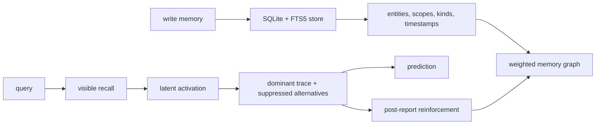

# King Synapse

<p align="center">
  <strong>Readable memory for coding agents.</strong><br />
  A local associative memory network that remembers facts, follows hidden influences,
  explains why one trace won, and learns after the current answer is finished.
</p>

<p align="center">
  <a href="https://github.com/lake121380-source/king-synapse/stargazers"></a>
  <a href="https://github.com/lake121380-source/king-synapse/blob/main/LICENSE"></a>
  
  
</p>

## Why This Exists

Most coding agents still forget like a browser tab.

They may remember a note, a rule, or a chat summary, but they usually cannot
show the chain behind a thought: what memory started it, what hidden influence
pulled it forward, which alternatives were suppressed, and what likely happens
next.

King Synapse treats memory as a network, not a notebook.

```text
visible memory -> hidden influence -> dominant trace -> possible future
                 \-> suppressed alternatives stay visible
```

That makes it useful for long-running coding agents that need to stop repeating
the same mistakes, stop re-learning your preferences, and explain their memory
instead of hiding it inside a black box.

## What It Does

- Stores memories locally in SQLite with explicit scope, kind, provenance, and time.
- Connects memories with weighted edges so recall can spread through a graph.
- Finds visible memories from a query, then activates hidden influences nearby.
- Reports the dominant trace and the suppressed alternatives.
- Predicts likely next influences from the winning trace.
- Reinforces an association only after the current report is already captured.
- Exposes the same engine through a CLI and an MCP server for coding agents.

## A Small Example

Imagine this chain:

```text
skipped water before commute
  -> tired mood
  -> narrower attention
  -> higher scooter fall risk
  -> future mistake risk
```

A flat memory system may retrieve one sentence. King Synapse tries to show the
path: the visible seed, the hidden influence that became dominant, the other
possible traces that lost, and the next risk that follows.

## Quick Start

```bash
git clone https://github.com/lake121380-source/king-synapse.git
cd king-synapse
cargo build --release
```

Write a few memories:

```bash
./target/release/kr write "Skipped water before the scooter commute lowered mood." --kind state --scope user
./target/release/kr write "Tired mood narrows commute attention and raises fall risk." --kind fact --scope user
./target/release/kr write "Future commute mistakes increase when attention narrows." --kind fact --scope user
```

Recall and inspect the chain:

```bash
./target/release/kr recall "water commute attention" --explain
./target/release/kr trace "forgot water before commute while tired" --auto-context --predict
./target/release/kr trace "forgot water before commute while tired" --auto-context --reinforce --reinforce-k 3
```

On Windows, use `.\target\release\kr.exe` instead of `./target/release/kr`.

## Use It From An Agent

King Synapse includes a stdio MCP server.

```json
{
  "mcp": {
    "king-synapse": {
      "type": "local",
      "command": ["path/to/synapse-mcp"],
      "enabled": true
    }
  }
}
```

The MCP server exposes tools for write, recall, recent-list, forget,
entity-list, neighbor lookup, edge inspection, reinforcement, latent activation,
latent query, and cognitive trace.

## How It Is Different

| Project | Best at | What King Synapse adds |
| --- | --- | --- |
| Mem0 | Product-style long-term memory for AI apps. | Inspectable trace competition: dominant influence, suppressed alternatives, and post-report reinforcement. |
| Graphiti/Zep | Temporal knowledge graphs and graph evidence. | A cognitive trace layer over recall: hidden influence activation, prediction, and reinforcement isolation. |
| Letta | Stateful agents with editable memory blocks. | A local graph memory engine that can explain why a memory path won. |
| Flat notes / rules files | Human-authored instructions. | Automatic recall, graph activation, edge learning, and explainable memory paths. |

## Current Evaluation

The checked-in external comparison report is
[external-comparison-latest.json](crates/eval/reports/external-comparison-latest.json).

| System | Local result on the cognitive fixture |
| --- | --- |
| King Synapse | 8/8 visible seed, 8/8 hidden influence, 8/8 dominant trace, 8/8 suppressed alternatives, 8/8 evidence paths, 8/8 future continuation, 8/8 reinforcement isolation. |
| Graphiti/Zep | 8/8 visible seed, 8/8 hidden influence, 8/8 evidence paths. Dominant/suppressed trace, prediction, and reinforcement are not exposed by this adapter. |
| Mem0 | 7/8 visible seed, 7/8 hidden influence through Mem0 OSS + DeepSeek + local Qdrant. Path evidence and trace competition are not exposed by this adapter. |
| Letta | Adapter is present, but the local run is not configured yet. |

Run the same comparison:

```bash
cargo run -p synapse-eval --bin kr-external-eval -- \
  --graphiti-command python \
  --graphiti-arg scripts/eval/graphiti_adapter.py \
  --mem0-command python \
  --mem0-arg scripts/eval/mem0_adapter.py \
  --letta-command python \
  --letta-arg scripts/eval/letta_adapter.py \
  --json crates/eval/reports/external-comparison-latest.json
```

## Architecture



The hot path is local-first. External services are only used by optional
comparison adapters or optional embedding/reranking paths.

## Project Status

- Core architecture is stable.
- Cognitive memory behavior is validated by local benchmarks and manual traces.
- External comparison is active: King Synapse, Graphiti/Zep, and Mem0 are measured; Letta, LongMemEval, and DMR are next.
- Public API stability notes live in `docs/API_SURFACE.md` and `docs/COMPATIBILITY.md`.

## Useful Commands

```bash
# Run the main tests
cargo test -p synapse-eval

# Run the cognitive-memory benchmark fixture
cargo bench -p synapse-eval --bench exported_cognitive_session

# Run recall benchmarks
cargo run --release -p synapse-eval --bin kr-eval -- --tag baseline-rrf --json crates/eval/reports/baseline-rrf.json

# Build release binaries
cargo build --release
```

## Documentation

| Doc | What it is for |
| --- | --- |
| `docs/ROADMAP.md` | Current roadmap and next work. |
| `docs/COGNITIVE_NETWORK_MODEL.md` | The cognitive-network algorithm model. |
| `docs/COGNITIVE_MEMORY_FINAL_ACCEPTANCE.md` | Final cognitive-memory acceptance gates. |
| `docs/eval/EXTERNAL_COMPARISON_PLAN.md` | External comparison plan and adapter rules. |
| `docs/API_SURFACE.md` | Public API surface. |
| `docs/COMPATIBILITY.md` | Stability and compatibility policy. |
| `docs/MANUAL_VALIDATION.md` | Manual validation transcript. |
| `docs/V3_PROPOSAL_REVIEW.md` | How the broader King Recall v3 idea maps to this implementation. |

## Star History

Stars are not the point of the engine, but they do help people find the work.

<a href="https://star-history.com/#lake121380-source/king-synapse&Date">
  <picture>
    <source media="(prefers-color-scheme: dark)" srcset="https://api.star-history.com/svg?repos=lake121380-source/king-synapse&type=Date&theme=dark" />
    <source media="(prefers-color-scheme: light)" srcset="https://api.star-history.com/svg?repos=lake121380-source/king-synapse&type=Date" />
    
  </picture>
</a>

## License

Apache-2.0. See `LICENSE`.
