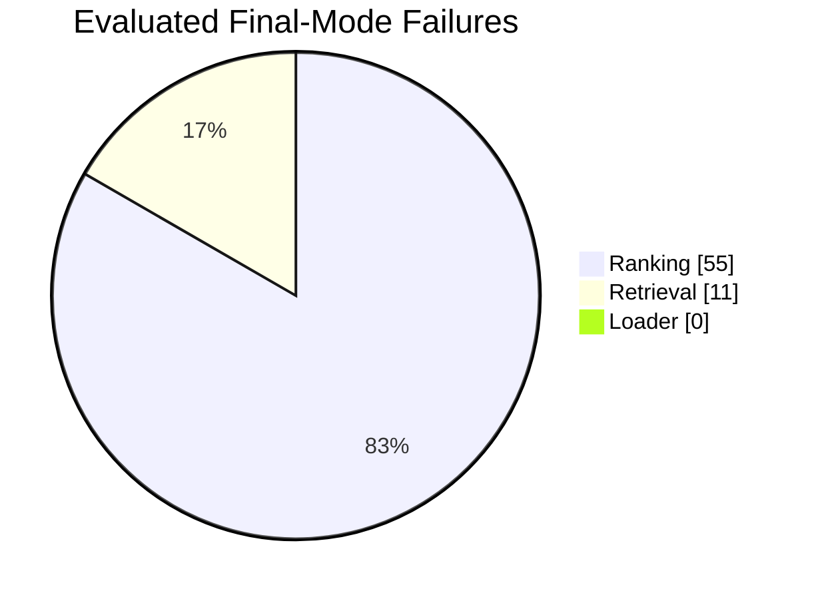

# Failure Analysis

Date: 2026-07-02

Scope:

- `crates/eval/reports/longmem-50-validation.json`
- `crates/eval/reports/dmr-50-validation.json`

This analysis uses anonymized sample IDs only. It does not include raw
questions, answers, dialogs, or retrieved text.

## Buckets

| Bucket | Meaning |
| --- | --- |
| Missing / chunk mapping | The expected answer text was not found in generated memory chunks, so the row could not enter evaluation. |
| Retrieval miss | No relevant memory appeared in the top 50. |
| Ranking | A relevant memory appeared after rank 1, including top-10-not-top-1 and top-50-not-top-10 cases. |
| Top 1 hit | Not a failure bucket; included as the stable success count. |

## Final-Mode Distribution

Final mode means `RRF + vectors + reranker`.

| Dataset | Top 1 hit | Ranking: top 10 not top 1 | Ranking: top 50 not top 10 | Retrieval miss | Missing / chunk mapping |
| --- | ---: | ---: | ---: | ---: | ---: |
| LongMemEval 50 | 18 | 18 | 8 | 6 | 0 |
| DMR 50 | 16 | 18 | 11 | 5 | 278 |
| Total evaluated | 34 | 36 | 19 | 11 | 278 pre-eval |

## Failure Distribution

Among the 100 evaluated final-mode queries:

| Failure | Count |
| --- | ---: |
| Retrieval | 11 |
| Ranking | 55 |
| Loader | 0 |
| Chunk / missing before evaluation | 278 DMR candidate rows |

The pre-evaluation DMR chunk/mapping issue is tracked separately because those
278 rows did not enter the evaluated 100-query denominator.

The dominant evaluated failure mode is ranking, not total retrieval absence.
The dominant pre-evaluation issue is DMR mapping: 278 candidate rows were
skipped because the current generated chunks did not contain the expected
answer text.

Follow-up DMR mapping audit:

- `docs/eval/DMR_MAPPING_AUDIT.md`
- `crates/eval/reports/dmr-mapping-audit.json`

The audit covered all 500 candidate rows. All rows generated five chunks. The
current exact answer-string rule accepted 82 rows and skipped 418 rows. Among
the skipped rows, 241 matched after punctuation-insensitive exact matching and
362 had all significant answer tokens in one chunk. Therefore the DMR pre-eval
skip is mainly a strict mapping/scoring boundary, not a loader-empty or
chunk-empty failure.

Punctuation-normalized DMR 50 rerun:

| Mode | Top 1 hit | Ranking: top 10 not top 1 | Ranking: top 50 not top 10 | Retrieval miss | Pre-eval missing/chunk rows |
| --- | ---: | ---: | ---: | ---: | ---: |
| Baseline RRF | 5 | 12 | 19 | 14 | 31 |
| RRF + vectors | 9 | 16 | 16 | 9 | 31 |
| RRF + vectors + reranker | 28 | 10 | 6 | 6 | 31 |

This rerun is tracked separately from the strict-string DMR baseline because it
admits a different candidate set.

DMR ranking failure audit:

- `docs/eval/RANKING_ABLATION.md`
- `crates/eval/reports/ranking-failure-audit-dmr-50.json`

The punctuation-normalized DMR 50 final-mode failures now split into:

| Bucket | Count |
| --- | ---: |
| Top-1 hit | 28 |
| Top-10 not top-1 | 10 |
| Top-50 only late rank | 6 |
| Top-50 retrieval miss | 6 |

The audit also shows that the reranker recovered 14 samples into top-10 and
promoted 12 samples to top-1, while suppressing 1 sample from top-10 and
demoting 1 top-1 sample. This confirms that reranking is valuable but not yet
fully reliable.

## LongMemEval Anonymous Cases

Final-mode examples, limited to the first 20 non-top-1 cases:

| Sample ID | Category | First relevant rank | Bucket | Failure type |
| --- | --- | ---: | --- | --- |
| `fe4511151e91186c` | single-session-preference | 8 | top_10 | top_10_not_top_1 |
| `c30691367b602930` | single-session-user | 46 | top_50 | wrong_rank |
| `7e26a029ba0f0d20` | knowledge-update | 9 | top_10 | top_10_not_top_1 |
| `37ca6c2bda1f0d8d` | knowledge-update | 10 | top_10 | top_10_not_top_1 |
| `f53179503b133fc4` | single-session-preference | absent | absent | retrieval_miss |
| `c3c4fd7cb0811efa` | knowledge-update | 2 | top_10 | top_10_not_top_1 |
| `0a99e5c960e760d5` | knowledge-update | 2 | top_10 | top_10_not_top_1 |
| `5f8989f5ce9918e9` | multi-session | 2 | top_10 | top_10_not_top_1 |
| `e5da28ab30404ae2` | single-session-preference | absent | absent | retrieval_miss |
| `e93aaf712ec66f02` | single-session-user | 8 | top_10 | top_10_not_top_1 |

## DMR Anonymous Cases

Final-mode examples, limited to the first 20 non-top-1 cases:

| Sample ID | First relevant rank | Bucket | Failure type |
| --- | ---: | --- | --- |
| `57b6b989521797c9` | 12 | top_50 | wrong_rank |
| `c46541722e486083` | absent | absent | retrieval_miss |
| `776cf885e5ecaeaa` | 48 | top_50 | wrong_rank |
| `7a788ef53726d3e2` | 2 | top_10 | top_10_not_top_1 |
| `f854941b0186f8c0` | 28 | top_50 | wrong_rank |
| `fbb4d10243d62605` | 9 | top_10 | top_10_not_top_1 |
| `9fd144e79228209f` | 2 | top_10 | top_10_not_top_1 |
| `08f41b439a71adf4` | 8 | top_10 | top_10_not_top_1 |
| `80a1b939a7e18a9f` | 15 | top_50 | wrong_rank |
| `4c4b25f96d26acff` | 3 | top_10 | top_10_not_top_1 |

## Conclusion

The 50-sample validation does not point to a core architecture failure.

The current system boundary is sharper now:

- LongMemEval needs the vector branch; reranker improves top-1 but can reduce
  top-10 coverage.
- DMR needs both vector retrieval and reranking, but the current candidate
  mapping skips too many rows before evaluation.
- Remaining evaluated failures are mostly ranking failures. The latest DMR
  audit splits them into late-ranking failures and top-50 retrieval misses, so
  the next technical investigation should focus on candidate ordering and chunk
  mapping before changing memory architecture.
